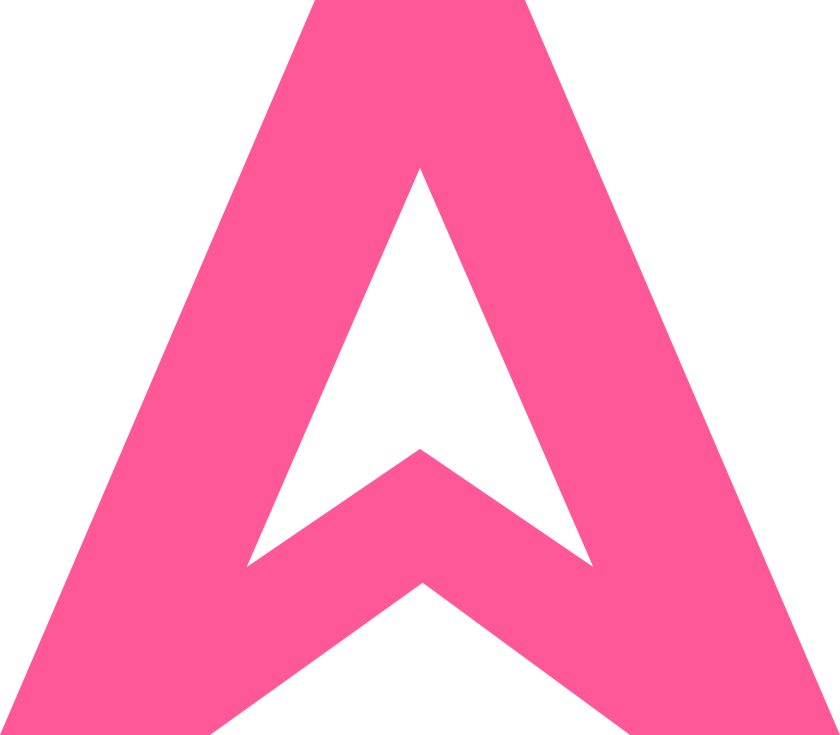

# Beyond Loop Engineering
## AdaL — From Vibe Coding to Vertical Agent SaaS

**AdaL Bootcamp 2 · Class 1**
**Date: July 4, 2026**

---

## Slide 1: Vibe Coding (Feb 2025)

> "There's a new kind of coding I call **'vibe coding'**, where you fully give in to the vibes, embrace exponentials, and forget that the code even exists."
> — **Andrej Karpathy**, February 3, 2025 ([tweet](https://x.com/karpathy/status/1886192184808149383))

**What it means:** Describe what you want → AI writes the code → you accept the output by vibe.

**The limit Karpathy himself flagged (June 17, 2025):** A prompt is something you type once and forget. The model got good enough to follow a *procedure* without supervision. The unit of leverage stopped being the prompt — **it became the procedure.**

**Software eras (Karpathy's framing):**
| Era | "Code" is… | When |
|-----|------------|------|
| Software 1.0 | Handwritten instructions | Since forever |
| Software 2.0 | Neural network weights | 2017 essay |
| Software 3.0 | Prompts in natural language | June 2025 keynote |

*Source: [YC — "Software Is Changing (Again)"](https://www.ycombinator.com/library/MW-andrej-karpathy-software-is-changing-again)*

*Speaker note: Vibe coding is the entry drug. It works for small things. It breaks when the task spans hours, files, and verification. That's what loop engineering solves — and what AdaL makes usable.*

---

## Slide 2: Anthropic's Pivot (mid-2025)

> "After a few years of **prompt engineering** being the focus… a new term has come to prominence: **context engineering**."
> — Anthropic, "Effective Context Engineering for AI Agents" ([source](https://www.anthropic.com/engineering/effective-context-engineering-for-ai-agents))

**Prompt engineering → Context engineering:**
- Prompt = writing good instructions (one-shot, static)
- Context = curating the *entire* token set the model sees each turn (system prompt + tools + MCP + history + notes + retrieved data)
- Context is a **finite resource** — "context rot" sets in as the window grows

**Three techniques Anthropic shipped for long-horizon agents:**
1. **Compaction** — summarize near-limit context, restart with the summary
2. **Structured note-taking** — agent writes notes to disk, reads them back after resets
3. **Sub-agent architectures** — specialized agents with clean context windows

**Why this matters for AdaL:** AdaL implements all three. Compaction runs automatically mid-turn. State lives in session files. Sub-agents (`agentic_search`, workers) handle deep work and return summaries.

*Speaker note: This slide explains the *constraints* AdaL is designed around. Context is precious → AdaL writes to disk. Sub-agents keep context clean → AdaL delegates. Compaction keeps the loop running → AdaL does it automatically.*

---

## Slide 3: Loop Engineering (June 2026)

> "Loop engineering is **replacing yourself as the person who prompts the agent**. You design the system that does it instead."
> — **Addy Osmani** (Google Cloud), June 7, 2026 ([blog](https://addyosmani.com/blog/loop-engineering/))

> "I don't prompt Claude anymore. I have loops running that prompt Claude. My job is to write loops."
> — **Boris Cherny**, head of Claude Code (Anthropic)

**The five pieces of a loop:**
1. **Automations** — scheduled discovery + triage
2. **Worktrees** — isolate parallel agents
3. **Skills** — codify project knowledge in `SKILL.md`
4. **Plugins / connectors** — MCP servers to your real tools
5. **Sub-agents** — split the maker from the checker
**+ State on disk** — markdown/boards that remember what's done

**Vibe coding vs. loop engineering:**
| Vibe coding | Loop engineering |
|-------------|------------------|
| You type a prompt | You design a procedure |
| You read the output | The loop reads and verifies |
| You decide when done | A separate evaluator checks the contract |
| Runs while you watch | Runs while you sleep |

---

## Slide 4: The Reality — Loop Engineering Today

**Where loop engineering actually stands in July 2026:**

The ideas work. A small minority of power users are running real loops in production. But for the vast majority of developers, loop engineering is still out of reach — not because the concept is wrong, but because **the tools ship primitives, not loops.** You still have to build and maintain the harness yourself.

### What's actually being done (by the power users)

| Pattern | How it works | Who does it |
|---------|--------------|-------------|
| **`/goal` run-until-done** | Claude Code's `/goal` uses a separate fast model (Haiku) to check a completion condition after each turn; agent keeps working until "yes" | Senior engineers who trust the setup |
| **TDD loops** | Write failing tests → implement → pass → commit, with a checklist file on disk; loop re-reads checklist each iteration | Developers on porting/migration tasks (one HN user ran Codex for 5 straight days on a massive port) |
| **Code review loops** | Agent writes code → separate agent reviews → re-edit if substantial changes → peer-review via a second model (e.g., Codex reviews Claude's output) | The most common and agreed-upon loop pattern |
| **Ticket-polling loops** | Poll Linear/Jira on an interval → pick up "to-do" tickets → spawn implementation agents → post PRs → human reviews and merges | A handful of power users (one Reddit user described this exact setup) |
| **Creative bug hunting** | One agent hunts bugs in a dedicated context → each bug fixed in its own fresh context → repeat until none found | Experienced agent-builders |
| **Hook-based quality gates** | Claude Code hooks (18+ lifecycle events) return exit code 2 to block the agent and send it back to fix issues before proceeding | Engineers who invest in hook configuration |

### What's painful (why most people can't do this)

**1. The harness is hand-crafted.** Every loop is a bespoke assembly of hooks, subagent TOML files, skills, cron schedules, and state files. As one HN commenter put it: *"Loops are currently carefully hand crafted, which makes them tedious and of questionable value."*

**2. Specs are the real bottleneck.** The agent delivers code as fast as you can write specs — then waits. Multiple HN commenters independently reported the same ceiling: *"I am bottle-necked on specs... by the time I finish the spec the agent is waiting for the next feature."* Writing a good spec takes almost as long as writing the code.

**3. Slop accumulates under local pressure.** Loops apply repetitive local fixes — add a fallback, add a guard, special-case the failing input, quiet the exception. This selects for code that's survivable in the short term but less intelligible in the long term. *"The problem is that loops apply local pressure repeatedly... Over time that selects for code that is more survivable in the short term but less intelligible in the long term."* (HN)

**4. Token costs are real.** Loops multiply token usage. One Reddit commenter called it a *"money glitch for AI companies"* — each iteration, each review, each failed attempt costs tokens. If subsidies end, many loops become uneconomical. An 8-person org spending €1,000/month on tokens noted that a 5-10x cost increase would make hiring humans cheaper.

**5. Trust hasn't been solved.** *"Leave AI unattended and it starts producing crap very quickly."* (Reddit). The `/goal` evaluator only reads the transcript — it can't independently verify. Even enthusiasts keep humans in the loop for design decisions, spec creation, and final review.

**6. It doesn't work for greenfield.** *"If you are a solo developer working on greenfield projects, loops don't do much."* (Reddit). Loops work best in mature codebases with existing patterns, tests, and specs — not new projects where you're still figuring out what you want.

### The result

Loop engineering is real, but it's locked behind a wall of infrastructure, spec-writing skill, and token budgets. The people who succeed with it are senior engineers who treat harness-building as a first-class engineering task — spending days configuring hooks, writing subagent TOMLs, and curating skill collections.

**Everyone else is still vibe coding** — typing prompts, hoping for the best, and manually verifying.

**AdaL changes this.** AdaL takes loop engineering from "build-your-own-harness" to "just describe what you want." The role separation, the plan-first contract, the state on disk, the sub-agent delegation, the auto-compaction — all built in. You don't wire hooks. You don't write TOML. You don't hand-craft a harness. You drive.

*Speaker note: The research here comes from HN ("The Coming Loop" thread, 245+ comments), Reddit r/ClaudeCode ("loop engineering === psyop" thread), and the Claude Code / Codex docs. The pattern is consistent: the primitives exist, the ideas work, but the harness is the barrier. AdaL is the pre-built harness.*

*Sources: [HN — The Coming Loop](https://news.ycombinator.com/item?id=48643180), [Reddit — loop engineering === psyop](https://www.reddit.com/r/ClaudeCode/comments/1ugy7w4/loop_engineering_psyop/), [Claude Code /goal docs](https://code.claude.com/docs/en/goal)*

---

## Slide 5: LOOPS.md — The Design Doc Behind AdaL

**Author:** Andrej Karpathy · **Version:** v060726 (June 7, 2026)

> "Most agent systems die not from a weak model but from a weak harness."

**Nine rules — these are the principles AdaL is engineered against:**

| # | Rule | How AdaL implements it |
|---|------|------------------------|
| I | Write the loop, not the prompt | AdaL runs gather → reason → act → verify across multi-step turns |
| II | Separate the roles | Planner / Generator / Evaluator are distinct prompts; sub-agents grade work the generator can't |
| III | Negotiate the contract first | AdaL plan-first rule: presents plan, gets confirmation, *then* edits |
| IV | Write to disk, not context | Session files, scratch dir, progress/contract/log on disk |
| V | Let the loop restart | Auto-compaction mid-turn; resumes seamlessly |
| VI | Score the subjective | Evaluator sub-agents verify against the agreed contract |
| VII | Read the traces | Every step = tool call → result, logged and inspectable |
| VIII | Delete the harness | Skills re-read and pruned; model does more each release |
| IX | The bottleneck always moves | AdaL surfaces the next step after each action |

*Speaker note: Don't memorize the rules. Just notice: every design choice in AdaL maps back to one of these. When AdaL asks for confirmation before editing, that's Rule III. When it delegates to a sub-agent, that's Rule II. When it writes to scratch files, that's Rule IV.*

---

## Slide 6: Driving AdaL — What You Need to Know

**How to work with AdaL (the mental model):**

| You do | AdaL does |
|--------|-----------|
| Give it a sentence | Turns it into a plan |
| Confirm the plan (for non-trivial tasks) | Reads files, gathers context via sub-agents |
| Watch the preamble + tool calls | Makes surgical edits, runs tests |
| Read the final answer | Verifies via evaluator, reports results |

**What AdaL will ask you for:**
- **Confirmation before editing** existing codebases (plan-first rule)
- **API key** (Anthropic or OpenAI) — set as env var
- **Clarification** only if proceeding without an answer would lead to a wrong solution

**What AdaL will NOT do:**
- Edit an existing codebase without a confirmed plan
- Grade its own work (evaluator is separate)
- Grow the harness monotonically (re-reads and prunes skills/tools)
- Commit secrets (`.env`, credentials, API keys)

**Best practices for driving AdaL:**
1. **Be specific** — "fix the null case in auth middleware" beats "fix auth"
2. **Let it plan** — for multi-file changes, let it present a plan before editing
3. **Read the traces** — when something goes wrong, read the raw transcript (Rule VII)
4. **Use skills** — write `SKILL.md` for repeated workflows so AdaL doesn't re-derive them
5. **Keep state on disk** — if you want AdaL to resume, put progress in a file

*Speaker note: This is the takeaway. AdaL is not a chatbot you prompt — it's an engineer you direct. You give it intent, it gives you a plan, you confirm, it executes and verifies. The better you are at writing clear intent, the better it performs.*

---

## Slide 7: Beyond Loop Engineering — AdaL's Full Offering

**Loop engineering is the engine. But AdaL is more than a coding agent — it's a platform for building vertical agent SaaS.**

AdaL gives you two layers: an autonomous coding agent to build your product, and an agent solution to power it.

### [1] Your autonomous & cost-effective coding agent

| Capability | What it does | How you use it |
|------------|--------------|----------------|
| **Deep research (worker)** | A sub-agent that researches the domain — reads docs, analyzes competitors, gathers context | Delegate: "research the X market, find the top 5 competitors and their pricing models" |
| **Coding** | Implements your product — writes code, runs tests, makes surgical edits | Drive: "build a SaaS landing page with a pricing table and email capture" |
| **Browser use** | Designs, builds, and debugs landing pages and web applications in a real browser | Drive: "clone this hero section at pixel fidelity" or "open the app, click through the flow, find the bug" |

**Engineer mode** ties it all together. It hides the complexity of:
- **Worker setup** — you don't configure sub-agents, model routing, or context windows; AdaL does
- **Model selection** — AdaL picks the right model for each task (fast model for eval, strong model for generation)
- **Loop engineering** — the planner/generator/evaluator loop runs automatically (slides 6–9)
- **Self-adaption to your tastes** — AdaL learns your conventions from skills, project files, and past sessions; it converges toward the way you work

**The pitch:** Describe what you want. AdaL researches the domain, writes the code, designs the UI in a browser, tests it, and iterates — all in one loop, all autonomous, all cost-effective.

### [2] Your agent solution

Once your product is built, AdaL gives you the infrastructure to run agents *inside* it:

| Component | What it is |
|-----------|------------|
| **Agent SDK** | A toolkit to build, configure, and deploy agents in your own application |
| **Agent cloud** | Hosted infrastructure — spin up an agent instantly without managing servers, models, or scaling |

**The vision:** You use AdaL the coding agent to *build* your vertical SaaS. Then you use AdaL the agent solution to *power* it. The same loop-engineering principles — role separation, contracts, disk state, sub-agents — run under the hood in both.

### What this means for vertical agent SaaS

| Traditional approach | AdaL approach |
|----------------------|---------------|
| Research the domain yourself (weeks) | Delegate to deep-research worker (hours) |
| Build the product with a dev team (months) | Drive AdaL to build it (days) |
| Design landing pages manually or hire a designer | Browser-use agent designs and debugs |
| Wire up agent infrastructure from scratch | Agent SDK + cloud, spin up instantly |
| Maintain the harness yourself | Engineer mode handles it, adapts to your tastes |

**AdaL's bet:** The next wave of SaaS is vertical agent products — domain-specific tools powered by autonomous agents. Building them requires both a great coding agent (to ship fast) and agent infrastructure (to run in production). AdaL is both.

*Speaker note: This is the bigger picture. Slides 6–11 covered AdaL as a coding agent — how the loop works, how to drive it. This slide expands: AdaL is also an agent platform. You build with it, then you deploy with it. The loop-engineering foundation makes both layers work — the same role separation, contracts, and disk state that make AdaL a good coder also make it a good agent runtime.*

---

## Slide 8: The Ecosystem — Other Tools & What They've Introduced

**Loop engineering didn't appear from nowhere. Several tools have contributed primitives. Here's the landscape — and where AdaL sits.**

| Tool | What it is | What it introduced for loop engineering | What you still have to build yourself |
|------|------------|----------------------------------------|--------------------------------------|
| **Claude Code** (Anthropic) | CLI coding agent | `/loop`, `/goal`, hooks, GitHub Actions, subagents in `.claude/agents/`, agent skills (`SKILL.md`) | Contract negotiation, planner/evaluator separation, disk-state conventions, auto-compaction tuning |
| **Codex** (OpenAI) | CLI + app agent | Automations tab, worktrees per thread, `$skill` invocation, TOML-defined subagents, `/goal` run-until-done | Same — you wire the roles, the contracts, the evaluator prompts |
| **Cursor** | AI-native IDE | Agent mode, inline edits, multi-file changes | Not loop-native — no automations, no sub-agents, no disk state. Best for in-flow vibe coding |
| **OpenCode** | Open-source CLI agent | Model-agnostic, extensible | Framework only — you build the loop yourself |

**The pattern:** Every tool ships *primitives*. None of them ship the *loop* — the role separation, the contract-first workflow, the disk-state conventions, the maker-checker split. You still have to build that harness yourself.

**Where AdaL is different:** AdaL doesn't give you primitives to wire together. It gives you the loop, pre-built and opinionated. The three roles are separate by default. The plan-first rule is enforced. The evaluator is a different agent with a different prompt. State goes to disk automatically. You don't build the harness — you drive it.

**AdaL's bet:** Loop engineering is the future, but only if it's accessible. The tools above are building blocks for engineers who can architect their own systems. AdaL is the system — pre-architected, pre-wired, ready to drive.

*Speaker note: This isn't "AdaL is better than Claude Code." It's a different layer. Claude Code gives you the parts; AdaL gives you the car. If you're a senior engineer who wants to build a custom loop, use the primitives. If you want to get work done without building infrastructure, use AdaL. Both are valid — they serve different needs.*

---

## Slide 9: Key People & References

**People who shaped this field (and AdaL's design):**

| Person | Role | Contribution |
|--------|------|--------------|
| **Andrej Karpathy** | Independent Researcher | Vibe coding (Feb 2025); Software 3.0 (June 2025); LOOPS.md (June 2026) |
| **Addy Osmani** | Director, Google Cloud AI | Named "loop engineering" (June 7, 2026) |
| **Peter Steinberger** | Engineer / blogger | "Design loops that prompt your agents" |
| **Boris Cherny** | Head of Claude Code, Anthropic | "I don't prompt Claude anymore. I write loops." |

**References:**
- [Karpathy's vibe-coding tweet](https://x.com/karpathy/status/1886192184808149383) — Feb 3, 2025
- [Karpathy: "Software Is Changing (Again)"](https://www.ycombinator.com/library/MW-andrej-karpathy-software-is-changing-again) — June 17, 2025
- [Anthropic: "Effective Context Engineering"](https://www.anthropic.com/engineering/effective-context-engineering-for-ai-agents) — mid-2025
- [Osmani: "Loop Engineering"](https://addyosmani.com/blog/loop-engineering/) — June 7, 2026
- LOOPS.md (v060726) — provided in class materials

---

## Slide 10: What's Next

**This bootcamp will teach you to drive AdaL end-to-end:**
1. ✅ **Class 1 — Introducing AdaL** (today): why it exists, how it works, the loop paradigm
2. ⬜ **Class 2 — Setup & first run**: install AdaL, API key, your first task
3. ⬜ **Class 3 — Driving the planner**: writing intent that becomes good plans
4. ⬜ **Class 4 — Contracts & verification**: the checklist pattern, test-first with AdaL
5. ⬜ **Class 5 — Skills**: codifying your project knowledge in `SKILL.md`
6. ⬜ **Class 6 — Sub-agents & parallel work**: maker vs. checker at scale

**Homework for next class:**
- Get an API key (Anthropic or OpenAI)
- Install AdaL
- Read `LOOPS.md` (provided) — come with one question
- Try one task: ask AdaL to read a file and summarize it

> "Build the loop. But build it like someone who intends to stay the engineer, not just the person who presses go."
> — Addy Osmani

